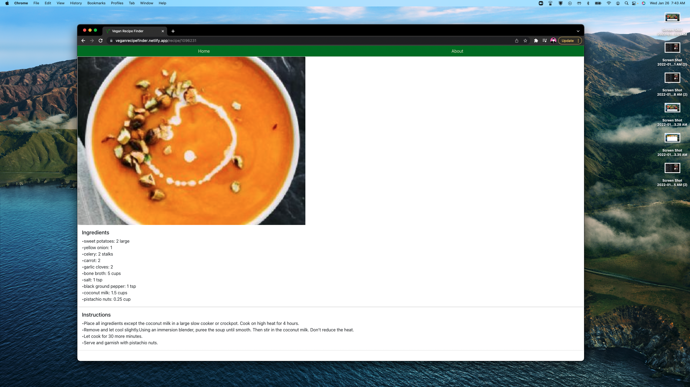

<h1>Vegan Recipe Finder</h1>
   
<i>Try it for <a href="https://veganrecipefinder.netlify.app/">yourself!</a></i>
 Note: For now, API requests are limited to 150 per day.  If the application is not working, the daily limit may have been reached.  Try again tomorrow.
  
<b>What is it?</b>
 
Vegan Recipe Finder is a useful tool I developed to help myself stop wasting groceries.  I can't tell you how many times I've boughten groceries only for them to rot in the refrigerator due to me not knowing what to do with them.  That is where Vegan Recipe Finder comes into play!  Simply type in the ingredients you want to see recipes for.  Then, the application will take your keywords and dig through a database of 1,000s of recipes that match your criteria.  It really is that simple!
  
<b>What technologies did I use to develop this app?</b>
 
For this application, I started out by coding the entire thing in Javascript, React, and HTML with very minimal CSS styling.  Then I implemented styling using Reactstrap.
  
<b>Contribution Guidelines</b>
Want to toy around with the code for yourself and implement features you think would work nicely?
<ul>
<li>Click the "Fork" tab on this page.</li>
<li>Take the link from your repo and clone it to your machine</li>
<li>Once your code is complete, push it to Github and create a Pull Request for me to review.</li>
</ul>
 
<b>Some shots of the application in action!</b>

  
<b>What are some stretch goals I have for this app?</b>
 
<ul>
<li> First off, I'd like to pay to upgrade my API request limit increased. 150 requests goes quick. </li>
<li> Secondly, once the limit is increased, I could add a filter to allow the user to display more recipes </li>
<li> Third, I'd like to give an option to search by cuisine type rather than by ingredients. </li>
<li> Fourth, I'd like to upgrade how I pull image data for the recipes. Currently I get the images from my API. But, their images are very low resolution and don't look good in my opinion. </li>
<li> Fifth, the API I'm using offers additional information for the recipes that I will incorporate including: nutrition facts, cost, ingredients widget, etc. </li>
</ul>
